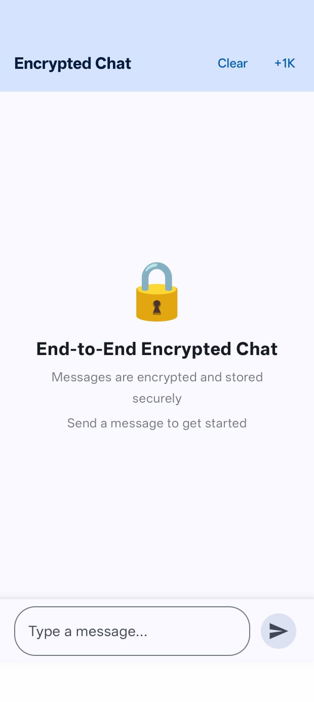
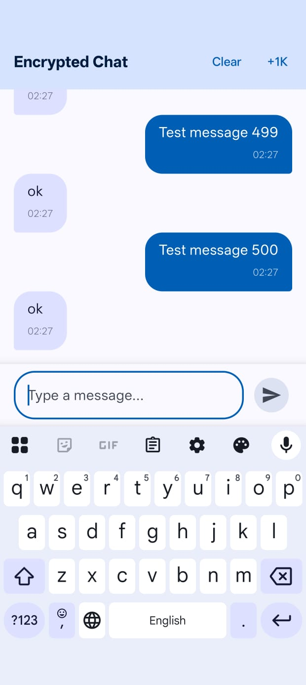
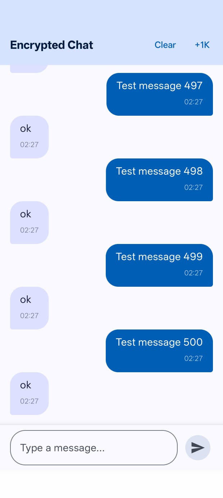

## 📸 Screenshots
<p align="center">
  
  
  
</p>

# End-to-End Encrypted Chat Application

A secure, single-screen 1:1 chat application built with Jetpack Compose that implements end-to-end encryption using Android Keystore. Messages are encrypted before storage, ensuring that unauthorized access to the APK or Room database cannot reveal any plaintext chat content.

## 🔐 Security Features

- **Android Keystore Encryption**: Uses AES-256-GCM authenticated encryption
- **Hardware-Backed Keys**: Keys are stored in hardware-backed Keystore when available
- **Non-Exportable Keys**: Encryption keys cannot be extracted from the device
- **Encrypted Storage**: Only ciphertext is stored in the Room database
- **No Plaintext Logging**: All sensitive data is handled securely without logging

## 🏗️ Architecture

This project follows **MVI (Model-View-Intent)** architecture with **Clean Architecture** principles


## 🛠️ Tech Stack

- **UI**: Jetpack Compose + Material 3
- **Architecture**: MVI (Model-View-Intent)
- **Dependency Injection**: Hilt
- **Database**: Room
- **Encryption**: Android Keystore + AES-256-GCM
- **Async**: Kotlin Coroutines + Flow
- **Language**: Kotlin

## 🚀 Features

### Core Features
- ✅ **Send/Receive Messages**: Simple text chat interface
- ✅ **End-to-End Encryption**: All messages encrypted before storage
- ✅ **Auto-Reply Simulation**: Automatically replies with "ok" after each sent message
- ✅ **Persistent Storage**: Messages saved in encrypted Room database
- ✅ **Real-time Updates**: Reactive UI using Kotlin Flow

### Performance Features
- ✅ **Large Dataset Testing**: Button to insert +1k test messages
- ✅ **Efficient Scrolling**: LazyColumn for smooth performance with large datasets
- ✅ **Background Operations**: All encryption/decryption on background threads
- ✅ **Auto-scroll**: Automatically scrolls to latest message

### UI/UX Features
- ✅ **Material 3 Design**: Modern, clean interface
- ✅ **Message Bubbles**: Distinct styling for sent vs received messages
- ✅ **Timestamps**: Each message shows time sent
- ✅ **Message Counter**: Displays total message count in toolbar
- ✅ **Empty State**: Helpful onboarding when no messages exist
- ✅ **Loading States**: Visual feedback during operations

## 🔒 How Encryption Works

### Encryption Flow
```
User Input → Plaintext Message → CryptoManager.encrypt()
    → Ciphertext + IV → Room Database
```

### Decryption Flow
```
Room Database → Ciphertext + IV → CryptoManager.decrypt()
    → Plaintext Message → UI Display
```

### Key Details
- **Algorithm**: AES-256-GCM (Galois/Counter Mode)
- **Key Size**: 256 bits
- **Authentication Tag**: 128 bits
- **IV**: Unique 12-byte initialization vector per message
- **Storage**: IV stored alongside ciphertext in database

## 📱 How to Use

### Running the App
1. Clone the repository
2. Open in Android Studio (Hedgehog or newer)
3. Sync Gradle dependencies
4. Run on an emulator or physical device (API 24+)

### Using the Chat
1. **Send a message**: Type in the input field and tap the send button
2. **Auto-reply**: After sending, you'll automatically receive "ok" as a reply
3. **Test performance**: Tap the "+1k" button in the toolbar to insert +1k test messages
4. **Scroll**: Messages automatically scroll to the bottom

## 🧪 Testing Encryption

### Verify Encrypted Storage
1. Run the app and send several messages
2. Extract the database from the device:
   ```bash
   adb shell run-as com.chat cat /data/data/com.chat/databases/chat_database > chat.db
   ```
3. Open `chat.db` with a SQLite browser
4. Inspect the `messages` table - you'll see only Base64-encoded ciphertext

### Verify No Plaintext in Logs
1. Enable verbose logcat filtering
2. Send messages with identifiable content
3. Search logs - no plaintext message content should appear

## 🎯 Performance Testing

The app includes a built-in performance testing utility:

- Tap the **"+1k"** button in the toolbar
- Inserts +1k encrypted messages into the database
- Messages are alternating sent/received with realistic timestamps
- UI remains smooth due to LazyColumn virtualization


### What's Protected
✅ Messages are encrypted at rest (Room database)  
✅ Keys stored in hardware-backed Keystore  
✅ Unique IV per message prevents pattern analysis  
✅ AES-GCM provides authenticated encryption  
✅ No plaintext in logs or memory dumps  

### What's NOT Covered (Out of Scope)
❌ Network transmission security (no networking required)  
❌ User authentication (single-screen app)  
❌ Multi-device sync  
❌ Secure key backup/recovery  
❌ Perfect forward secrecy  

## 📝 Requirements Met

- ✅ **UI**: Single chat screen with sent/received bubbles and timestamps
- ✅ **Encryption**: Android Keystore-backed AES-256-GCM encryption
- ✅ **Storage**: Room database with only ciphertext stored
- ✅ **Auto-reply**: Simulated "ok" replies after each sent message
- ✅ **Testing**: Large dataset utility for performance testing
- ✅ **Performance**: Smooth scrolling even with thousands of messages
- ✅ **Code Quality**: Clean Kotlin with MVI, Coroutines, and Flow
- ✅ **Security**: Proper Keystore usage, no plaintext at rest


Built as a coding challenge demonstrating:
- Secure Android development practices
- Clean architecture implementation
- Modern Android development with Jetpack Compose
- Encryption and cryptography best practices
- All encryption happens on background thread (Dispatchers.IO)
